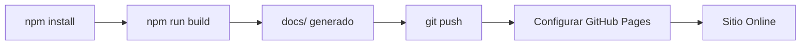

# 📋 Resumen de Deployment - FISC Platform

Este documento resume la configuración del proyecto para GitHub Pages.

---

## ✅ Estado de Configuración

### Archivos Críticos Configurados

| Archivo | Estado | Configuración |
|---------|--------|---------------|
| `vite.config.ts` | ✅ Configurado | `base: '/FISC/'` |
| `package.json` | ✅ Configurado | Scripts de build con auto-copy a docs/ |
| `index.html` | ✅ Configurado | Entry point en raíz |
| `src/main.tsx` | ✅ Configurado | Importa App.tsx correctamente |
| `tsconfig.json` | ✅ Configurado | Configuración completa de TypeScript |
| `.gitignore` | ✅ Configurado | Ignora node_modules y dist |

### Scripts de Deployment

| Script | Estado | Descripción |
|--------|--------|-------------|
| `deploy.sh` | ✅ Creado | Script automático para Linux/Mac |
| `deploy.bat` | ✅ Creado | Script automático para Windows |
| `npm run build` | ✅ Funcional | Build + copia a docs/ |

### Documentación

| Documento | Estado | Propósito |
|-----------|--------|-----------|
| `DEPLOYMENT_GUIDE.md` | ✅ Creado | Guía completa paso a paso |
| `GITHUB_PAGES_SETUP.md` | ✅ Creado | Guía visual con screenshots |
| `PRE_DEPLOY_CHECKLIST.md` | ✅ Creado | Checklist de verificación |
| `QUICK_DEPLOY.md` | ✅ Creado | Comandos rápidos |
| `README.md` | ✅ Actualizado | Documentación principal |

---

## 🎯 Configuración de GitHub Pages

### Configuración Requerida

```yaml
Repository: FISC
Branch: main
Folder: /docs
```

### URL Final

```
https://TU_USUARIO.github.io/FISC/
```

---

## 🔧 Configuración Técnica

### vite.config.ts

```typescript
export default defineConfig({
  plugins: [react()],
  base: '/FISC/',  // ← Configurado para GitHub Pages
})
```

### package.json - Scripts

```json
{
  "scripts": {
    "dev": "vite",
    "build": "tsc && vite build && npm run copy-to-docs",
    "copy-to-docs": "node -e \"require('fs').cpSync('dist', 'docs', {recursive: true})\"",
    "preview": "vite preview"
  }
}
```

**Funcionalidad:**
1. `npm run build` compila TypeScript
2. Vite genera la carpeta `dist/`
3. Automáticamente copia `dist/` a `docs/`
4. `docs/` es la carpeta que GitHub Pages usa

---

## 📦 Estructura de Carpetas

### Antes del Build

```
FISC/
├── components/
├── data/
├── hooks/
├── styles/
├── src/
│   └── main.tsx
├── App.tsx
├── index.html
├── vite.config.ts
└── package.json
```

### Después del Build

```
FISC/
├── ... (archivos fuente)
├── dist/              ← Generado por Vite (temporal)
└── docs/              ← Generado para GitHub Pages (permanente)
    ├── index.html
    └── assets/
        ├── index-[hash].js
        └── index-[hash].css
```

---

## 🚀 Flujo de Deployment

### Primera Vez



### Actualizaciones


---

## ✅ Verificaciones Pre-Deploy

### Checklist Técnico

- [x] **vite.config.ts** tiene `base: '/FISC/'`
- [x] **package.json** tiene script `copy-to-docs`
- [x] **index.html** está en la raíz
- [x] **src/main.tsx** importa App correctamente
- [x] **.gitignore** configurado
- [x] **Scripts de deployment** creados
- [x] **Documentación completa** generada

### Verificaciones del Usuario

Antes de hacer push, verifica:

- [ ] `npm install` ejecutado
- [ ] `npm run build` completa sin errores
- [ ] Carpeta `docs/` existe y tiene contenido
- [ ] `npm run preview` funciona en http://localhost:4173/FISC/
- [ ] Repositorio de GitHub creado
- [ ] Git remote configurado

---

## 📝 Comandos de Deployment

### Setup Inicial

```bash
# 1. Clonar o tener el proyecto
cd FISC

# 2. Instalar dependencias
npm install

# 3. Build
npm run build

# 4. Verificar preview
npm run preview
```

### Deploy a GitHub

```bash
# 1. Commit
git add .
git commit -m "Deploy: FISC Platform"

# 2. Push
git push origin main

# 3. Configurar GitHub Pages en la web
# Settings → Pages → Branch: main → Folder: /docs → Save
```

---

## 🎯 URLs Importantes

### Desarrollo Local

- **Dev Server**: http://localhost:5173
- **Preview**: http://localhost:4173/FISC/

### Producción

- **GitHub Repo**: https://github.com/TU_USUARIO/FISC
- **GitHub Pages**: https://TU_USUARIO.github.io/FISC/
- **Settings**: https://github.com/TU_USUARIO/FISC/settings/pages

---

## 🐛 Troubleshooting Rápido

### Problema: docs/ no se genera

**Solución:**
```bash
npm run build
# Si falla, verifica que package.json tenga el script copy-to-docs
```

### Problema: 404 en GitHub Pages

**Solución:**
- Verifica Settings → Pages → Folder: `/docs`
- Espera 5 minutos después de configurar
- Verifica que la carpeta docs/ esté en tu repo

### Problema: Preview funciona pero GitHub Pages no

**Solución:**
- Asegúrate de que `vite.config.ts` tenga `base: '/FISC/'`
- Haz rebuild: `npm run build`
- Push de nuevo

---

## 📊 Métricas del Proyecto

### Archivos de Configuración
- ✅ 6 archivos de configuración creados
- ✅ 2 scripts de deployment (Windows + Linux/Mac)
- ✅ 5 documentos de guía creados

### Funcionalidades
- ✅ Build automático a docs/
- ✅ Preview con base URL correcta
- ✅ Scripts de deployment automatizados
- ✅ Documentación completa

---

## 🎉 Estado Final

### ✅ Proyecto 100% Listo para GitHub Pages

El proyecto está completamente configurado para:
1. ✅ Build de producción optimizado
2. ✅ Generación automática de carpeta docs/
3. ✅ Deploy a GitHub Pages
4. ✅ URLs relativas correctas
5. ✅ Scripts de automatización
6. ✅ Documentación completa

---

## 📚 Documentación Disponible

| Documento | Para Quién | Cuándo Usar |
|-----------|------------|-------------|
| [QUICK_DEPLOY.md](./QUICK_DEPLOY.md) | Usuarios avanzados | Deploy rápido |
| [DEPLOYMENT_GUIDE.md](./DEPLOYMENT_GUIDE.md) | Todos | Guía completa |
| [GITHUB_PAGES_SETUP.md](./GITHUB_PAGES_SETUP.md) | Principiantes | Primera vez |
| [PRE_DEPLOY_CHECKLIST.md](./PRE_DEPLOY_CHECKLIST.md) | Todos | Antes de deploy |
| [README.md](./README.md) | Todos | Info del proyecto |

---

## ⚡ Quick Start

```bash
npm install
npm run build
git add .
git commit -m "Deploy: FISC Platform"
git push origin main
```

Luego configura GitHub Pages:
**Settings → Pages → Branch: main → Folder: /docs → Save**

---

## 🎯 Próximos Pasos

1. Ejecuta `npm install`
2. Ejecuta `npm run build`
3. Verifica que funcione con `npm run preview`
4. Sigue la guía en [QUICK_DEPLOY.md](./QUICK_DEPLOY.md)

---

**✅ Tu proyecto FISC está listo para publicar en GitHub Pages**

**URL Final**: `https://TU_USUARIO.github.io/FISC/`

---

© 2025 FISC Platform - Configurado y listo para deployment 🚀
