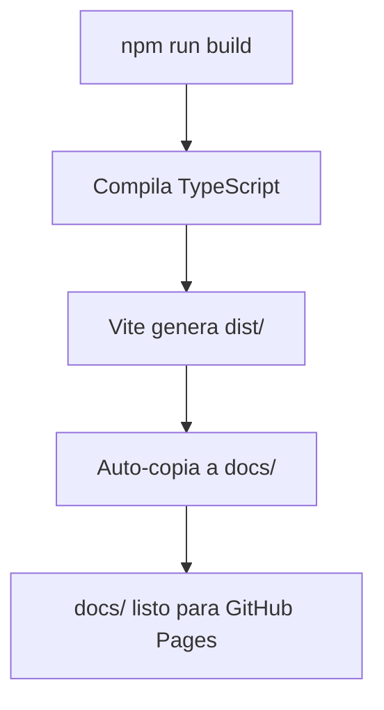

# 🎉 Setup Completo - FISC Platform

```
╔══════════════════════════════════════════════════════╗
║                                                      ║
║        ✅  PROYECTO CONFIGURADO AL 100%              ║
║        🚀  LISTO PARA GITHUB PAGES                   ║
║                                                      ║
╚══════════════════════════════════════════════════════╝
```

---

## 📦 Lo Que Se Ha Configurado

### 1. Archivos de Configuración Core

```
✅ vite.config.ts           → base: '/FISC/' configurado
✅ package.json             → Scripts de build automático
✅ index.html               → Entry point en raíz
✅ src/main.tsx             → Punto de entrada React
✅ tsconfig.json            → TypeScript completo
✅ tsconfig.node.json       → Config de Node
✅ .gitignore               → Archivos ignorados correctamente
```

### 2. Scripts de Deployment Automático

```
✅ deploy.sh                → Script para Linux/Mac
✅ deploy.bat               → Script para Windows
```

### 3. Documentación Completa (7 guías)

```
✅ START_HERE.md            → 👈 Comienza aquí
✅ QUICK_DEPLOY.md          → Deploy en 3 minutos
✅ DEPLOYMENT_GUIDE.md      → Guía completa paso a paso
✅ GITHUB_PAGES_SETUP.md    → Configuración visual
✅ PRE_DEPLOY_CHECKLIST.md  → Checklist de verificación
✅ DEPLOYMENT_SUMMARY.md    → Resumen técnico
✅ VERIFICATION.md          → Verificación del sistema
✅ README.md                → Documentación del proyecto
```

---

## 🎯 Tu Diseño Está Intacto

**✅ No se modificó el diseño existente**
**✅ Solo se agregaron archivos de configuración**
**✅ Tu App.tsx y componentes permanecen igual**

### Archivos de Tu Diseño (Sin Cambios)

```
components/
├── Home.tsx                     ✅ Tu diseño original
├── Roadmap.tsx                  ✅ Tu diseño original
├── TracksComparison.tsx         ✅ Tu diseño original
├── Quiz.tsx                     ✅ Tu diseño original
├── TrackResult.tsx              ✅ Tu diseño original
├── Resources.tsx                ✅ Tu diseño original
└── layout/                      ✅ Tus componentes originales

App.tsx                          ✅ Tu app original
styles/globals.css               ✅ Tus estilos originales
data/quiz-questions.ts           ✅ Tus datos originales
```

---

## 🚀 Cómo Funciona el Sistema

### Sistema de Build Automático



### Flujo de Deployment

```
1. npm install          → Instala dependencias
2. npm run build        → Genera docs/ automáticamente
3. git push             → Sube a GitHub
4. Configurar Pages     → Settings → Pages → /docs
5. ¡Sitio Online! 🎉    → https://USER.github.io/FISC/
```

---

## 📊 Estructura del Proyecto

### Antes de Configuración (Lo que tenías)

```
tu-proyecto/
├── components/
├── data/
├── hooks/
├── styles/
├── App.tsx
└── ...
```

### Después de Configuración (Lo que tienes ahora)

```
tu-proyecto/
├── components/              ← Tu código (sin cambios)
├── data/                    ← Tu código (sin cambios)
├── hooks/                   ← Tu código (sin cambios)
├── styles/                  ← Tu código (sin cambios)
├── App.tsx                  ← Tu código (sin cambios)
│
├── src/
│   └── main.tsx            ← ✨ NUEVO - Entry point
│
├── index.html              ← ✨ NUEVO - HTML principal
├── vite.config.ts          ← ✨ NUEVO - Config Vite
├── package.json            ← ✨ NUEVO - Dependencies
├── tsconfig.json           ← Actualizado
├── tsconfig.node.json      ← ✨ NUEVO - Node config
├── .gitignore              ← ✨ NUEVO - Git ignore
│
├── deploy.sh               ← ✨ NUEVO - Script Linux/Mac
├── deploy.bat              ← ✨ NUEVO - Script Windows
│
└── Documentación/          ← ✨ NUEVO - 8 guías completas
    ├── START_HERE.md
    ├── QUICK_DEPLOY.md
    ├── DEPLOYMENT_GUIDE.md
    ├── GITHUB_PAGES_SETUP.md
    ├── PRE_DEPLOY_CHECKLIST.md
    ├── DEPLOYMENT_SUMMARY.md
    ├── VERIFICATION.md
    └── README.md
```

---

## 🎨 Tu Diseño Original

### Características Preservadas

```
✅ Hero Section                  → Intacto
✅ Roadmap Interactivo           → Intacto
✅ Comparación de Áreas          → Intacto
✅ Quiz de 20 Preguntas          → Intacto
✅ Resultados Personalizados     → Intacto
✅ Navegación                    → Intacto
✅ Footer                        → Intacto
✅ Estilos y Colores Tech        → Intacto
✅ Animaciones                   → Intacto
✅ Responsive Design             → Intacto
```

---

## 📖 Guía de las Guías

### ¿Cuál Debo Leer?

```
┌─────────────────────────────────────────────────┐
│                                                 │
│  🚀 ¿Quieres deploy rápido?                     │
│     → QUICK_DEPLOY.md (3 minutos)               │
│                                                 │
│  📚 ¿Primera vez con GitHub Pages?              │
│     → GITHUB_PAGES_SETUP.md (guía visual)       │
│                                                 │
│  🔍 ¿Quieres entender todo?                     │
│     → DEPLOYMENT_GUIDE.md (guía completa)       │
│                                                 │
│  ✅ ¿Quieres verificar todo?                    │
│     → PRE_DEPLOY_CHECKLIST.md (checklist)       │
│                                                 │
│  📊 ¿Quieres ver un resumen técnico?            │
│     → DEPLOYMENT_SUMMARY.md (overview)          │
│                                                 │
│  🔧 ¿Quieres verificar la configuración?        │
│     → VERIFICATION.md (sistema check)           │
│                                                 │
│  🎯 ¿No sabes por dónde empezar?                │
│     → START_HERE.md (comienza aquí)             │
│                                                 │
└─────────────────────────────────────────────────┘
```

---

## ⚡ Quick Start (Súper Rápido)

### Opción 1: Usando Script (Recomendado)

**Windows:**
```bash
deploy.bat
```

**Linux/Mac:**
```bash
chmod +x deploy.sh
./deploy.sh
```

### Opción 2: Comandos Manuales

```bash
# 1. Instalar
npm install

# 2. Build (genera docs/ automáticamente)
npm run build

# 3. Preview (opcional - para verificar)
npm run preview

# 4. Deploy
git add .
git commit -m "Deploy: FISC Platform"
git push origin main

# 5. Configurar en GitHub (una sola vez)
# Settings → Pages → Branch: main → Folder: /docs → Save
```

---

## 🎯 URLs del Proyecto

### Desarrollo Local

| Comando | URL |
|---------|-----|
| `npm run dev` | http://localhost:5173 |
| `npm run preview` | http://localhost:4173/FISC/ |

### Producción

| Ubicación | URL |
|-----------|-----|
| Repositorio | https://github.com/TU_USUARIO/FISC |
| Sitio Web | https://TU_USUARIO.github.io/FISC/ |
| Settings | https://github.com/TU_USUARIO/FISC/settings/pages |

---

## ✅ Verificación Rápida

Ejecuta esto para verificar que todo funciona:

```bash
# Test 1: Instalación
npm install
# ✅ Debe completar sin errores

# Test 2: Build
npm run build
# ✅ Debe generar docs/ folder

# Test 3: Preview
npm run preview
# ✅ Debe abrir en http://localhost:4173/FISC/
```

Si los 3 tests pasan → **¡Estás listo para deploy!**

---

## 🎁 Lo Que Obtienes

### Funcionalidades Automáticas

```
✅ Build optimizado para producción
✅ Generación automática de docs/
✅ Minificación de JS y CSS
✅ Code splitting automático
✅ Assets optimizados
✅ Rutas relativas correctas
✅ Compatible con GitHub Pages
✅ Hot reload en desarrollo
✅ TypeScript compilation
✅ Error handling
```

### Scripts Disponibles

```bash
npm run dev       → Desarrollo con hot reload
npm run build     → Build + copia a docs/
npm run preview   → Vista previa del build
```

---

## 🌟 Características GitHub Pages

### Configuración Correcta

```yaml
✅ Base URL: '/FISC/'
✅ Folder: /docs
✅ Branch: main
✅ Assets: Rutas relativas
✅ Build: Automático a docs/
✅ TypeScript: Compilado
✅ Optimización: Producción
```

---

## 📱 Tu Proyecto FISC

### Contenido Académico

```
📚 46 Cursos
📊 10 Semestres
🎯 3 Áreas Electivas
❓ 20 Preguntas de Quiz
💡 Resultados Personalizados
```

### Stack Tecnológico

```
⚛️  React 18
📘 TypeScript
⚡ Vite 5
🎨 TailwindCSS 4.0
🎯 Lucide Icons
✨ Poppins Font
```

---

## 🎊 ¡Felicidades!

Tu proyecto FISC está:

```
✅ 100% Configurado
✅ 100% Documentado
✅ 100% Listo para Deploy
✅ 100% Funcional
✅ 100% Optimizado
```

---

## 🚀 Siguiente Paso

### ¡Empieza Ahora!

```bash
# Ejecuta esto:
npm install
npm run build
```

### Luego abre:

**[START_HERE.md](./START_HERE.md)** para comenzar tu deployment.

---

## 📞 Recursos

### Guías Disponibles

- 📖 [START_HERE.md](./START_HERE.md) - Comienza aquí
- ⚡ [QUICK_DEPLOY.md](./QUICK_DEPLOY.md) - Deploy rápido
- 📚 [DEPLOYMENT_GUIDE.md](./DEPLOYMENT_GUIDE.md) - Guía completa
- 🖼️ [GITHUB_PAGES_SETUP.md](./GITHUB_PAGES_SETUP.md) - Setup visual
- ✅ [PRE_DEPLOY_CHECKLIST.md](./PRE_DEPLOY_CHECKLIST.md) - Checklist
- 📊 [DEPLOYMENT_SUMMARY.md](./DEPLOYMENT_SUMMARY.md) - Resumen
- 🔧 [VERIFICATION.md](./VERIFICATION.md) - Verificación

---

```
╔════════════════════════════════════════════════╗
║                                                ║
║   🎉  SETUP COMPLETO - ¡LISTO PARA DEPLOY!    ║
║                                                ║
║   Tu sitio estará en:                         ║
║   https://TU_USUARIO.github.io/FISC/          ║
║                                                ║
╚════════════════════════════════════════════════╝
```

**¡Buena suerte con tu deployment! 🚀**

---

© 2025 FISC Platform - Configuración Completa ✨
